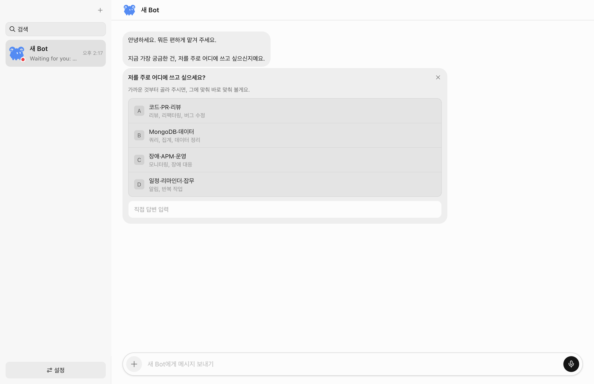
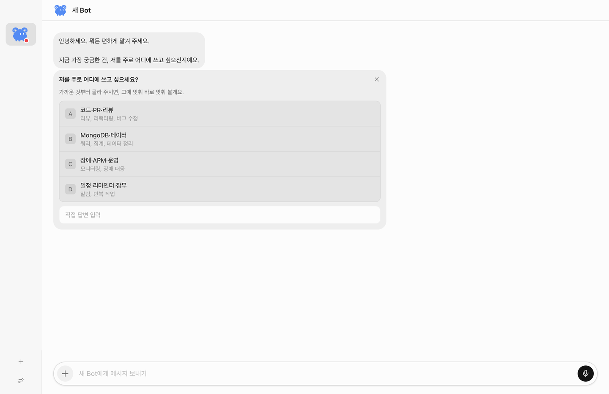
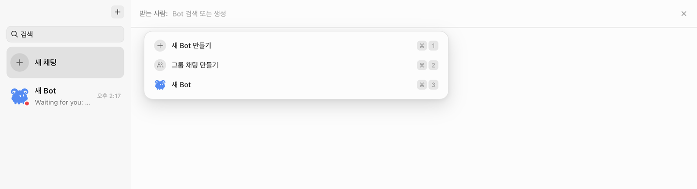
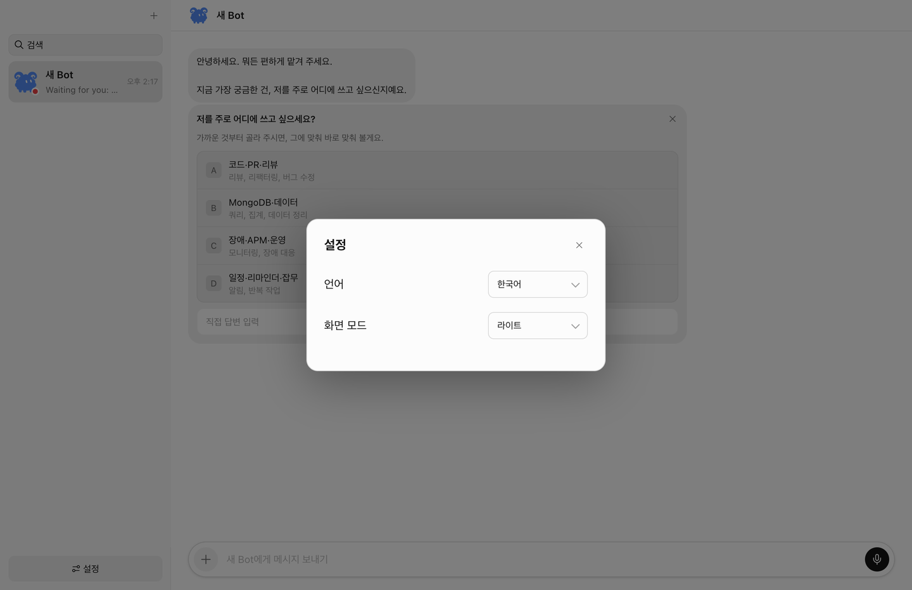

# herdr-bot

[English](README.md)

herdr에서 돌아가는 에이전트를, [Grok Bot](https://x.ai/bot)에게 말 걸듯 부리는 macOS 앱.



Grok Bot은 봇을 팀원처럼 두고, 여러 봇에게 일을 나눠 맡기는 메신저다. herdr-bot은 그 사용감을 herdr 위로 가져온다. 봇 한 명은 herdr pane 안의 에이전트(claude, codex, grok…)이고, 채팅에 쓴 말은 그 에이전트의 프롬프트가 된다.

클라우드 컴퓨터도, 앱 로그인이나 결제도 없다. 이미 로그인해 둔 에이전트 CLI와, 실행 중인 herdr를 그대로 쓴다. Grok Bot 자체는 아니며, 대화 방식을 레퍼런스로 만든 로컬 앱이다.

## 화면

### 메신저로 일을 맡긴다

사이드바에는 봇의 얼굴, 마지막 말, 시각, 읽지 않은 표시가 쌓인다. 대화창에서 봇은 먼저 묻기도 하고, 고를 수 있는 답을 내밀기도 한다. 아래 입력창에서 파일을 붙이고, `@`로 그 방의 봇을 부른다. Enter는 전송, Shift+Enter는 줄바꿈.

### 좁히면 아이콘만 남는다



사이드바는 240px에서 400px 사이를 드래그한다. 최소보다 더 안쪽으로 밀면 아바타만 있는 레일로 접히고, 다시 바깥으로 당기면 목록이 돌아온다. ⌘B로도 접었다 편다. 레일 아래에는 새 봇과 설정만 있다.

### 봇을 만들거나, 이미 떠 있는 에이전트를 데려온다



`+`에서 새 Bot을 띄우거나 그룹 채팅을 만든다. 새 Bot은 herdr에 에이전트를 새로 띄울 수도 있고, 그 세션에 이미 있는 에이전트를 채택할 수도 있다. 그룹은 봇을 최대 6명까지 한 방에 넣는다.

### 설정은 언어와 화면뿐이다



한국어가 기본이고 English로 바꿀 수 있다. 라이트와 다크는 저장된다. Plugin 메뉴와 계정 화면은 없다. 외부 도구는 각 에이전트가 원래 쓰던 CLI와 MCP를 탄다.

## 할 수 있는 일

- **1:1.** 봇마다 채팅이 있다. 내가 보낸 말은 그 봇의 herdr 에이전트에게 간다.
- **그룹.** 말하면 봇들이 라운드로빈으로 답한다. `@이름`이면 그 봇만 부른다. 한 번에 최대 3라운드, 발언은 10번까지.
- **페르소나.** 봇 이름과 역할 설명을 고친다. 방 이름을 누르면 멤버를 넣거나 뺀다. 채팅은 고정할 수 있다.
- **herdr 세션.** 봇은 기본적으로 `herdr-bot` 세션에 뜬다. pane을 보려면 `herdr session attach herdr-bot`. 메인 세션에 두고 싶으면 `HERDR_BOT_SESSION=default`.

## 시작하기

herdr 0.9.0 이상이 실행 중이어야 하고, Node는 24 이상이다. 봇으로 쓸 에이전트 CLI는 미리 로그인되어 있어야 한다.

```bash
npm install
npm run desktop:start
```

UI만 볼 때는 `npm run desktop:dev:fake`. 앱 번들은 `npm run desktop:package`.

터미널에서만 쓸 때:

```bash
node cli/src/main.ts serve
node cli/src/main.ts bot create reviewer --name Reviewer --kind claude --cwd ~/repo
node cli/src/main.ts room create "auth 리팩터링" --members reviewer
node cli/src/main.ts send <room-id> "로그인 버그 원인부터 정리해줘"
node cli/src/main.ts read <room-id>
```

## 말이 일로 가는 경로

봇은 herdr가 pane 안에서 알아보는, 이름이 붙은 에이전트다. 새로 띄울 때는 `herdr agent start`, 이미 떠 있는 에이전트를 데려올 때는 `herdr agent rename`. 호출은 모두 `herdr --session <HERDR_BOT_SESSION>`으로 그 세션을 향한다.

방에 글이 오면 호스트가 턴을 돌린다. 각 턴은 `herdr agent prompt <bot> … --wait`다. 봇이 방에 글을 올리는 방법은 `~/.herdr-bot/bin/herdr-bot say <room> "…"`뿐이다. 터미널에 찍힌 출력은 채팅에 올라오지 않는다.

대화 기록은 `~/.herdr-bot/`의 JSONL이다. `HERDR_BOT_HOME`으로 옮길 수 있다.

봇에게 채팅으로 이름·레이블·설명 변경을 요청할 수 있다. 봇은 자신의 pane에서
`herdr-bot profile get`, `herdr-bot profile update --name '레이' --label '리뷰' --description '코드 리뷰 담당'`를 사용한다.
수정할 필드만 지정하고, 레이블·설명에 빈 문자열을 주면 지운다. 저장 결과는 화면에 반영되며,
화면에서 직접 수정한 내용도 다음 DM·그룹 턴에 최신 프로필로 전달된다.

## 환경 변수

| 변수 | 기본 | 의미 |
|---|---|---|
| `HERDR_BOT_HOME` | `~/.herdr-bot` | 상태 루트 |
| `HERDR_BIN_PATH` | `herdr` | herdr 바이너리 |
| `HERDR_BOT_SESSION` | `herdr-bot` | 봇이 뜨는 herdr 세션. `default`면 메인 세션 |
| `HERDR_BOT_SOCKET_PATH` | 세션의 `herdr.sock` | herdr 이벤트 구독. pane이 주입하는 `HERDR_SOCKET_PATH`는 그 pane의 세션을 가리키므로 쓰지 않는다 |
| `HERDR_BOT_USER_NAME` | OS 사용자명 | 방에서 보이는 이름 |
| `HERDR_BOT_TURN_TIMEOUT_MS` | `180000` | 봇 한 턴을 기다리는 시간 |
| `HERDR_BOT_DEFAULT_KIND` / `HERDR_BOT_DEFAULT_CWD` | `claude` / `$HOME` | 봇을 만들 때의 기본값 |

## 개발

```bash
npm run check
```

화면은 grok-bot 0.18 렌더러를 포크한 것이다. 어디까지 가져왔고 어디를 고쳤는지는 `renderer/UPSTREAM.md`. 개인 용도 빌드이며, 원본 번들의 아이콘과 이모지 데이터는 넣지 않는다.

앱 아이콘(`desktop/build/icon.icns`, `icon.png`)은 `desktop/build/icon-source.jpg`에서 만든다. 바탕을 지우고 로고만 잘라, macOS 아이콘 격자(1024 캔버스, 824 본체, 사방 100px 여백)에 맞춘다.

```bash
pip install pillow
python3 scripts/make-app-icon.py
iconutil -c icns desktop/build/herdr-bot.iconset -o desktop/build/icon.icns
rm -rf desktop/build/herdr-bot.iconset
```
